⚠️ Important Release Notes – Version 1.0.0 (June 3, 2025)

Please carefully review the following changes before deploying this version of the script in Jamf Pro:

📌 Configuration Management Update

Script Management via Configuration Profile:The script is now managed through a configuration profile.

Pre-filled JSON:

Use PatchHelper_Settings_with_pre-filled_text.json to leverage pre-filled text entries.

Select desired text values from dropdown menus; edits can be made as necessary.

Manual JSON:

Alternatively, use PatchHelper_Settings.json if you prefer to set all text entries manually.

🔑 API Token Management

API Tokens via API Roles and Clients:API tokens must now be created using Jamf Pro’s "API Roles and Clients" feature.

Dedicated Jamf Pro user accounts for API access are no longer required.

🎨 Icons and Validation Checks

Centralized Icons:

Icons and validation checks are no longer defined within the script.

These are now provided via the profile file named icon_service.json.

Improved Reusability:

Centralizing icons simplifies updates and allows reuse across multiple scripts.

## Patch Helper
A script that serves to display to the user all available updates for the affected device in a dialogue.

## What does it do?
The script consolidates the various update notifications and generates a single window for the user that:

_- Informs about the number of updates available_

_- Lists which applications will be updated_

_- Provides the count of available postponements_

_- Specifies how frequently the dialogue restarts._

The user will be informed about which applications are currently being updated and also about the results.

## Preparing
Download the latest Version of the Script.

Enable Patch Management in Jamf Pro. This will subsequently serve for:

_1. A graphical representation in Jamf Pro_

_2. Creating dynamic groups for the policies_

For a step-by-step guide, please refer to the Wiki.

## Configuration

For the configuration of the policy, please refer to the following guide.

## It's not working!
Sorry about that. If you're willing and able to help test, please report.

```mermaid
flowchart TD

    %% =========================================================
    %% PATCH HELPER - START / PREFLIGHT
    %% =========================================================

    START([Start])

    START --> PREFS["Check configuration profiles<br/>Managed Preferences + Icon Service"]

    PREFS --> KEYS{"Required keys<br/>available?"}

    KEYS -- No --> EXIT_PREFS["Exit script<br/>No window shown"]
    KEYS -- Yes --> ROOT{"Running as root?"}

    ROOT -- No --> EXIT_ROOT["Exit script<br/>No window shown"]
    ROOT -- Yes --> USER["Determine logged-in user"]

    USER --> DIALOGCHECK["Check swiftDialog"]

    DIALOGCHECK --> DIALOGINSTALLED{"swiftDialog<br/>installed?"}

    DIALOGINSTALLED -- Yes --> DEFERRAL["Load or initialize<br/>deferral counter"]

    DIALOGINSTALLED -- No --> INSTALLDIALOG["Download swiftDialog<br/>and verify Team ID"]

    INSTALLDIALOG --> DIALOGVERIFY{"Verification<br/>successful?"}

    DIALOGVERIFY -- No --> EXIT_DIALOG["Exit script<br/>No Patch Helper window"]
    DIALOGVERIFY -- Yes --> DEFERRAL

    DEFERRAL --> DAEMONSTATE["Check LaunchDaemon state<br/><br/>plist exists?<br/>service loaded?<br/>ready?"]


    %% =========================================================
    %% UPDATE DISCOVERY
    %% =========================================================

    DAEMONSTATE --> TOKEN{"Jamf API token<br/>available?"}

    TOKEN -- Yes --> GETPOLICIES["Retrieve policies<br/>assigned to device"]

    GETPOLICIES --> APPPLIST["Build Applications.plist<br/><br/>Policy ID<br/>Policy Name"]

    APPPLIST --> INITIALCOUNT["Determine<br/>initial_Update_Count"]

    TOKEN -- No --> DEBUGJSON["Debug / fallback mode<br/>Use test policyJSON"]

    INITIALCOUNT --> POLICIES
    DEBUGJSON --> POLICIES

    POLICIES["Process available policies"] --> ATTRIBUTES["Load policy attributes<br/><br/>Icon<br/>Validation<br/>Bundle ID"]

    ATTRIBUTES --> BUNDLE{"Bundle ID<br/>available?"}

    BUNDLE -- No --> ADDJSON["Add policy to policyJSON"]

    BUNDLE -- Yes --> RUNNING{"Application currently<br/>running?"}

    RUNNING -- Yes --> ADDJSON

    RUNNING -- No --> BACKGROUND["Run background update<br/><br/>jamf policy -id ID<br/>-forceNoRecon"]

    BACKGROUND --> BACKRESULT{"Background update<br/>successful?"}

    BACKRESULT -- Yes --> REDUCE["Reduce Update_Count"]
    BACKRESULT -- No --> ADDJSON

    REDUCE --> MOREPOLICIES{"More policies<br/>to process?"}
    ADDJSON --> MOREPOLICIES

    MOREPOLICIES -- Yes --> ATTRIBUTES
    MOREPOLICIES -- No --> BUILDJSON["Build final policyJSON"]


    %% =========================================================
    %% JSON STRUCTURE
    %% =========================================================

    BUILDJSON --> JSONSTEP["Create one JSON step per<br/>remaining application"]

    JSONSTEP --> JSONFIELDS["Each step contains:<br/><br/>listitem<br/>icon<br/>progresstext<br/>trigger_list"]

    JSONFIELDS --> INVENTORY["Append final step:<br/>Update Inventory<br/>trigger = recon"]

    INVENTORY --> REMAINING{"Remaining<br/>Update_Count = 0?"}


    %% =========================================================
    %% NO UPDATES
    %% =========================================================

    REMAINING -- Yes --> NOWINDOW["No user window required"]

    NOWINDOW --> CLEANUP_NOUPDATE["Cleanup deferral state<br/>and LaunchDaemon"]

    CLEANUP_NOUPDATE --> END_NOUPDATE([End])


    %% =========================================================
    %% FIRST WINDOW
    %% =========================================================

    REMAINING -- No --> PROMPTJSON["Read policyJSON for<br/>first user prompt"]

    PROMPTJSON --> PROMPTARGS["Dynamically create<br/>--listitem arguments<br/><br/>Application Name + Icon"]

    PROMPTARGS --> WINDOW1["WINDOW 1<br/><br/>User Update Prompt<br/><br/>Dynamic application list / table<br/>built from policyJSON"]

    WINDOW1 --> DEFERRALS{"Deferrals<br/>remaining?"}

    DEFERRALS -- Yes --> DEFERRALUI["Show:<br/>Update button<br/>Defer button<br/>Timer"]

    DEFERRALS -- No --> ENFORCEDUI["Show:<br/>Update button only<br/><br/>No deferral allowed"]

    DEFERRALUI --> USERACTION{"User action"}
    ENFORCEDUI --> USERACTION


    %% =========================================================
    %% USER ACTION
    %% =========================================================

    USERACTION -- Update --> WINDOW2

    USERACTION -- Defer --> DECREMENT
    USERACTION -- Timer expired --> DECREMENT

    DECREMENT["Reduce deferral counter"] --> ENSUREDAEMON["EnsureLaunchDaemon()"]

    ENSUREDAEMON --> DAEMONREADY{"LaunchDaemon<br/>ready?"}

    DAEMONREADY -- Yes --> DEFEREXIT["Exit current workflow<br/><br/>LaunchDaemon remains active<br/>and schedules the next run"]

    DAEMONREADY -- No --> RESTORE["Restore previous<br/>deferral counter"]

    RESTORE --> EXIT_DEFERERROR["Exit with error"]

    USERACTION -- Info / unexpected exit --> EXIT_USERACTION["Exit current workflow<br/>No update workflow started"]


    %% =========================================================
    %% SECOND WINDOW / UPDATE WORKFLOW
    %% =========================================================

    WINDOW2["WINDOW 2<br/><br/>Patch Helper Progress Window<br/><br/>Progress bar<br/>Application list<br/>Individual status"]

    WINDOW2 --> READJSON["Read policyJSON"]

    READJSON --> NEXTSTEP["Select next JSON step"]

    NEXTSTEP --> STEPINFO["Read:<br/><br/>listitem<br/>icon<br/>progresstext<br/>trigger_list"]

    STEPINFO --> STATUSINSTALL["Update list row<br/>Status = Installing"]

    STATUSINSTALL --> TRIGGERTYPE{"Trigger type"}

    TRIGGERTYPE -- Policy ID --> RUNPOLICY["Run Jamf Policy<br/><br/>jamf policy -id ID<br/>-forceNoRecon"]

    TRIGGERTYPE -- recon --> RUNRECON["Run Jamf Recon"]

    RUNPOLICY --> VALIDATE["Validate result"]
    RUNRECON --> VALIDATE

    VALIDATE --> SUCCESS{"Step<br/>successful?"}

    SUCCESS -- Yes --> STEPSUCCESS["List item status<br/>Success"]

    SUCCESS -- No --> STEPFAIL["List item status<br/>Failed<br/><br/>Remember failure"]

    STEPSUCCESS --> PROGRESS["Increment progress"]
    STEPFAIL --> PROGRESS

    PROGRESS --> MORESTEPS{"More JSON<br/>steps?"}

    MORESTEPS -- Yes --> NEXTSTEP
    MORESTEPS -- No --> FINALISE{"Any failed<br/>updates?"}


    %% =========================================================
    %% FINAL RESULT
    %% =========================================================

    FINALISE -- No --> SUCCESSUI["Show successful completion<br/>in Patch Helper window"]

    SUCCESSUI --> QUITSUCCESS["quitScript(0)"]

    FINALISE -- Yes --> FAILURESTATE["Show failure state<br/>in Patch Helper window"]

    FAILURESTATE --> WINDOW3["WINDOW 3<br/><br/>Failure Information Dialog<br/><br/>Displays failed applications<br/>and support information"]

    WINDOW3 --> QUITFAIL["quitScript(1)"]


    %% =========================================================
    %% FINAL CLEANUP
    %% =========================================================

    QUITSUCCESS --> TEMPFILES
    QUITFAIL --> TEMPFILES

    TEMPFILES["Remove temporary files"] --> TOKENINVALIDATE["Invalidate API token<br/>if available"]

    TOKENINVALIDATE --> CLEANUPFLAG{"Update workflow<br/>completed?"}

    CLEANUPFLAG -- Yes --> CLEANSTATE["CleanupDeferralState()"]

    CLEANSTATE --> DEFPLIST{"Deferral plist<br/>exists?"}

    DEFPLIST -- Yes --> DELETEDEF["Delete deferral plist"]
    DEFPLIST -- No --> LDPLIST

    DELETEDEF --> LDPLIST{"LaunchDaemon plist<br/>exists?"}

    LDPLIST -- Yes --> DELETELD["Delete LaunchDaemon plist"]
    LDPLIST -- No --> LDLOADED

    DELETELD --> VERIFYDELETE["Verify LaunchDaemon plist<br/>was actually removed"]

    VERIFYDELETE --> LDLOADED{"LaunchDaemon<br/>loaded?"}

    LDLOADED -- No --> END([End])

    LDLOADED -- Yes --> BOOTOUT["launchctl bootout<br/>system/LaunchDaemonLabel"]

    BOOTOUT --> END


    %% =========================================================
    %% WINDOW LEGEND
    %% =========================================================

    subgraph LEGEND["Window behavior"]
        direction TB

        L0["No Window<br/>Preflight failure or no remaining updates"]

        L1["Window 1<br/>Update Prompt<br/>Dynamic application table"]

        L2["Window 2<br/>Patch Helper<br/>Update progress"]

        L3["Window 3<br/>Failure Dialog<br/>Only when the completed workflow contains errors"]
    end


    %% =========================================================
    %% STYLING
    %% =========================================================

    classDef normal fill:#eef5ff,stroke:#2563eb,stroke-width:1px,color:#111827;
    classDef decision fill:#ffffff,stroke:#2563eb,stroke-width:2px,color:#111827;
    classDef success fill:#ecfdf5,stroke:#16a34a,stroke-width:1px,color:#14532d;
    classDef failure fill:#fef2f2,stroke:#dc2626,stroke-width:1px,color:#7f1d1d;
    classDef warning fill:#fffbeb,stroke:#d97706,stroke-width:1px,color:#78350f;
    classDef window fill:#f5f3ff,stroke:#7c3aed,stroke-width:2px,color:#2e1065;
    classDef terminal fill:#f3f4f6,stroke:#374151,stroke-width:2px,color:#111827;
    classDef json fill:#eff6ff,stroke:#0284c7,stroke-width:2px,color:#0c4a6e;

    class PREFS,USER,DIALOGCHECK,INSTALLDIALOG,DEFERRAL,DAEMONSTATE,GETPOLICIES,APPPLIST,INITIALCOUNT,POLICIES,ATTRIBUTES,BACKGROUND,REDUCE,PROMPTJSON,PROMPTARGS,READJSON,NEXTSTEP,STEPINFO,STATUSINSTALL,RUNPOLICY,RUNRECON,VALIDATE,PROGRESS,TEMPFILES,TOKENINVALIDATE,VERIFYDELETE,BOOTOUT normal;

    class KEYS,ROOT,DIALOGINSTALLED,DIALOGVERIFY,TOKEN,BUNDLE,RUNNING,BACKRESULT,MOREPOLICIES,REMAINING,DEFERRALS,USERACTION,DAEMONREADY,TRIGGERTYPE,SUCCESS,MORESTEPS,FINALISE,CLEANUPFLAG,DEFPLIST,LDPLIST,LDLOADED decision;

    class STEPSUCCESS,SUCCESSUI,QUITSUCCESS,CLEANSTATE,DELETEDEF,DELETELD,CLEANUP_NOUPDATE success;

    class EXIT_PREFS,EXIT_ROOT,EXIT_DIALOG,STEPFAIL,FAILURESTATE,WINDOW3,QUITFAIL,EXIT_DEFERERROR failure;

    class DEBUGJSON,DECREMENT,ENSUREDAEMON,DEFEREXIT,RESTORE,EXIT_USERACTION warning;

    class WINDOW1,WINDOW2 window;

    class BUILDJSON,JSONSTEP,JSONFIELDS,INVENTORY,ADDJSON json;

    class START,END,END_NOUPDATE terminal;
```

